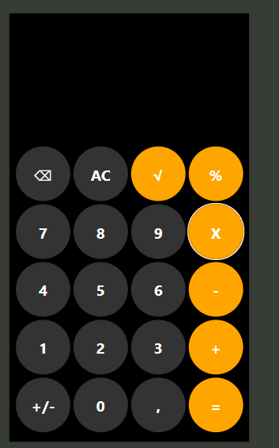

Requisitos:

A calculadora deve fazer as operações básicas(soma, subtração, multiplicação, divisão) e a raiz quadrada

As operações devem ser feitas uma de cada vez

O stakeholder não definiu a interface que deseja, sugeri a do Iphone e ele concordou

Primeira Versão da Interface(Incompleta, falta o número na qual vamos operar):

