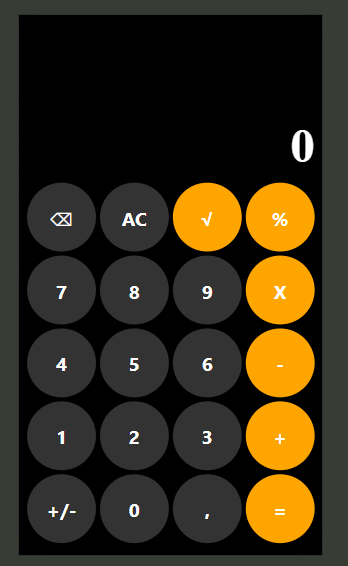
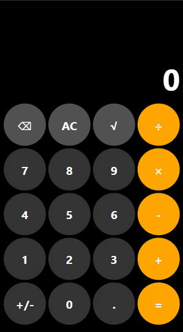
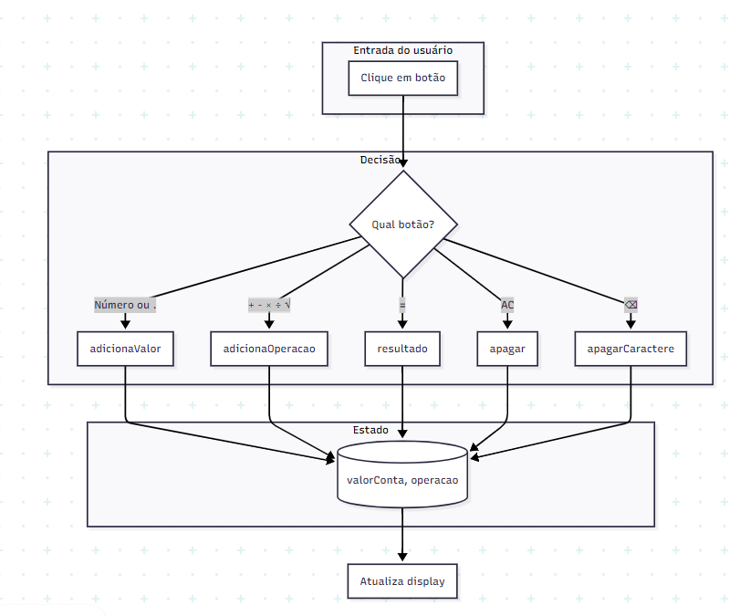

# Calculadora

App de calculadora em React Native (Expo), inspirado na interface do iPhone. Operações básicas e raiz quadrada, uma operação por vez.

---

## Requisitos

- A calculadora deve fazer as operações básicas (soma, subtração, multiplicação, divisão) e a raiz quadrada.
- As operações devem ser feitas uma de cada vez.
- O stakeholder não definiu a interface; foi sugerida a do iPhone e ele concordou.

---

## Como rodar

```bash
npm install
npm start
```

Depois escaneie o QR code com o app Expo Go (Android) ou use o simulador (iOS/Android).

---

## Interface

Layout em tema escuro, display no topo e botões circulares. Operadores (÷, ×, -, +, =) em laranja; números e utilitários (AC, √, ⌫) em cinza.

**Protótipo (primeira versão, incompleta):**


**Primeira versão completa:**



**Interface final:**



---

## Fluxo da aplicação

Cada clique em um botão dispara uma ação:

- **Número ou `.`** — `adicionaValor`: concatena ao valor exibido (ou substitui o "0" inicial).
- **`+`, `-`, `×`, `÷`, `√`** — `adicionaOperacao`: acrescenta o operador e guarda qual operação está ativa.
- **`=`** — `resultado`: calcula e mostra o resultado.
- **AC** — `apagar`: zera display e operação.
- **⌫** — `apagarCaractere`: remove o último caractere.

O estado fica em `valorConta` (string do display) e `operacao` (último operador). Depois de qualquer ação, o display é atualizado.



---

## Estrutura principal

Toda a lógica e a UI estão em `app/_layout.tsx`: estado (`useState`), as funções acima e o layout dos botões com `StyleSheet`.
